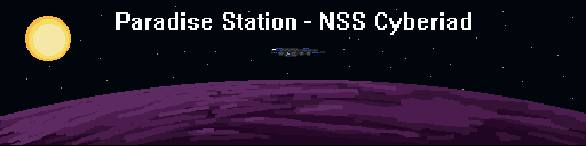
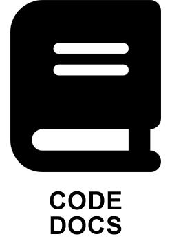

<div class="header" align="center">
<a href="#"></a>

## <p align="center">Welcome to the main repository for the Paradise Station version of [Space Station 14](https://github.com/space-wizards/space-station-14).</p>
</div>

Space Station 14 is a remake of SS13 that runs on [Robust Toolbox](https://github.com/space-wizards/RobustToolbox), a homegrown engine written in C#.

### Any work done in a non-base namespace may contain incorrect attributions due to rewrites and recommitting.

<p align="center">
	<a href="https://xkcd.com/371/"></a>
	<a href="https://xkcd.com/1811/"></a>
</p>

<p align="center">
	<a href="https://discord.gg/YJDsXFE">
		<picture>
			<source media="(prefers-color-scheme: dark)" srcset=".github/assets/discord-light.png">
			<source media="(prefers-color-scheme: light)" srcset=".github/assets/discord-dark.png">
			
		</picture>
	</a>
	<a href="https://devdocs.paradisestation.org">
		<picture>
			<source media="(prefers-color-scheme: dark)" srcset=".github/assets/book-light.png">
			<source media="(prefers-color-scheme: light)" srcset=".github/assets/book-dark.png">
			
		</picture>
	</a>
	<a href="https://www.paradisestation.org/">
		<picture>
			<source media="(prefers-color-scheme: dark)" srcset=".github/assets/web-light.png">
			<source media="(prefers-color-scheme: light)" srcset=".github/assets/web-dark.png">
			
		</picture>
	</a>
	<a href="https://paradisestation.org/wiki">
		<picture>
			<source media="(prefers-color-scheme: dark)" srcset=".github/assets/wiki-light.png">
			<source media="(prefers-color-scheme: light)" srcset=".github/assets/wiki-dark.png">
			
		</picture>
	</a>
</p>

#### Space Station 14
<div class="header" align="center">

[Website](https://spacestation14.io/) | [Discord](https://discord.ss14.io/) | [Forum](https://forum.spacestation14.io/) | [Steam](https://store.steampowered.com/app/1255460/Space_Station_14/) | [Standalone Download](https://spacestation14.io/about/nightlies/)

</div>

# Useful Documents and Links

## Documentation/Wiki

The [docs site](https://docs.spacestation14.io/) has documentation on SS14s content, engine, game design and more.
Additionally, see these resources for license and attribution information:
- [Robust Generic Attribution](https://docs.spacestation14.com/en/specifications/robust-generic-attribution.html)
- [Robust Station Image](https://docs.spacestation14.com/en/specifications/robust-station-image.html)

> [!TIP]
> Want to contribute for the first time but unsure where to start?<br>
> Join our Discord and check out the [#coding_chat](https://discord.com/channels/145533722026967040/145700319819464704) channel for helpful links and advice!<br>

- ### [Code of Conduct](https://devdocs.paradisestation.org/code_of_conduct/)

All contributors are expected to read our Code of Conduct before they take part in our community.

- ### [Contribution Guide](https://devdocs.paradisestation.org/contributing/)

Not sure how to take part and contribute? This guide gives an overview of how to make comments, pull requests, and open issues.

This guide also sets out our code standards that we expect all submitted code to adhere to.

## AI-generated contributions disclaimer
This project does not accept low-effort or wholesale AI-generated contributions. Examples include, but are not limited to:

- Any code (including yaml) generated by tools like GitHub Copilot, ChatGPT, or similar.
- AI-created artwork, sound files, or other assets.
- Auto-generated documentation, issue reports or pull request descriptions.

## Building

1. Clone this repo:
```shell
git clone https://github.com/DeltaV-Station/Delta-v.git
```
2. Go to the project folder and run `RUN_THIS.py` to initialize the submodules and load the engine:
```shell
cd Delta-v
python RUN_THIS.py
```
3. Compile the solution:

Build the server using `dotnet build`.

[More detailed instructions on building the project.](https://docs.spacestation14.com/en/general-development/setup.html)

## License

Read [LEGAL.md](/LEGAL.md) for legal information regarding the code licensing.

Most assets are licensed under [CC-BY-SA 3.0](https://creativecommons.org/licenses/by-sa/3.0/) unless stated otherwise. Assets have their license and the copyright in the metadata file. [Example](https://github.com/DeltaV-Station/Delta-v/blob/master/Resources/Textures/Objects/Tools/crowbar.rsi/meta.json).

Code taken from [Project Starlight](https://github.com/ss14Starlight/space-station-14) was taken in accordance with the [Starlight License](./LICENSE-Starlight.txt).

> [!NOTE]
> Some assets are licensed under the non-commercial [CC-BY-NC-SA 3.0](https://creativecommons.org/licenses/by-nc-sa/3.0/) or similar non-commercial licenses and will need to be removed if you wish to use this project commercially.
